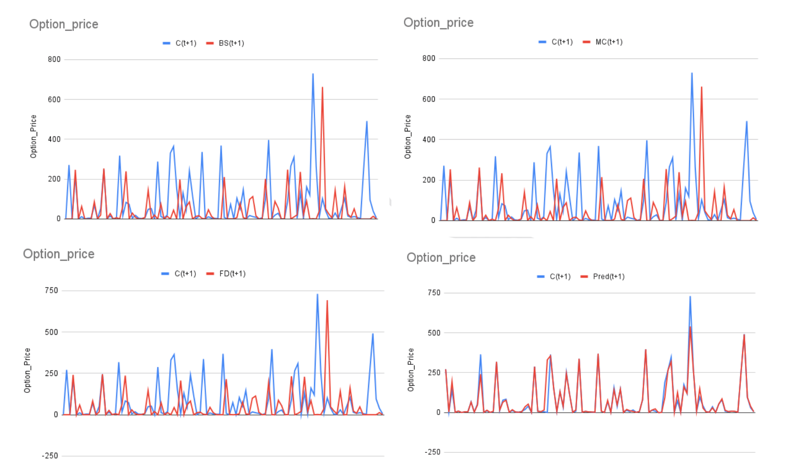

# Analysing Hybrid Models for Option Pricing in Indian Markets

## Introduction

This project aims to explore and evaluate a hybrid model that combines traditional parametric option pricing models like **Black-Scholes**, **Monte Carlo**, and **Finite Difference Method** with nonparametric machine learning techniques such as **Support Vector Regression (SVR)** for option pricing in the Indian markets.

## Data Collection and Preprocessing

### Step 1: Data Collection

The data used for our forecasting model consists of real options on the BANK NIFTY index, which was collected from the [National Stock Exchange of India (NSE) website](http://www.nseindia.com). Specifically, we have used trading data for Call Options for the years 2013 and 2014, covering the months from March to December.

To calculate the Risk-Free Interest Rate (RFIR) required for option pricing, we collected the MIBOR (Mumbai Interbank Offered Rate) data from the [Trading Economics website](https://tradingeconomics.com/india/interbank-rate).

### Step 2: Data Preprocessing

**Merge Data:** We merged all the collected data into a single file to facilitate further processing.

**Volatility Calculation** and **Time to Expiry Calculation** are being done.

### Step 3: Option Price Calculation

For our hybrid model, we calculated the values of option prices using three different methods:

1. **Black-Scholes (BS) Option Pricing Model:** This parametric model was used to calculate the option prices.

2. **Monte Carlo Option Pricing Model:** We employed the Monte Carlo simulation to determine the option prices.

3. **Finite Difference Method:** The finite difference method was used to estimate option prices.

### Step 4: Data Normalization

The input features for the forecasting models were normalized to the range 0.0–1.0. Normalization is a crucial step in preparing the data for machine learning models.

### Step 5: Data Segmentation

To improve the forecasting accuracy, the data was divided into six different datasets based on Moneyness (S/K) and Time to Maturity.

## Model Training

### Step 6: Support Vector Regression (SVR)

The SVR model was trained using the six datasets obtained from Step 5. Support Vector Regression is a powerful nonparametric machine learning technique that aims to find the best-fitting function to predict the option prices.

## Conclusion

This GitHub repository contains all the code and relevant files to reproduce the analysis of hybrid models for option pricing in Indian markets. The project aims to provide insights into the effectiveness of combining parametric option pricing models with machine learning techniques like SVR. Feel free to explore the code, data, and results to gain a deeper understanding of the study.

Please refer to the individual files and directories for more detailed information about each step and the code implementation. If you have any questions or feedback, please don't hesitate to raise an issue or contact the project contributors.

Thank you for your interest in this project! Happy exploring!

